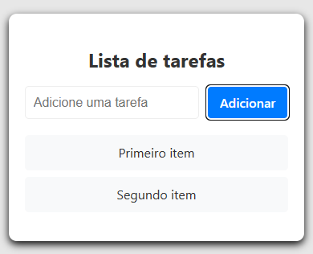

# To Do List

This a simple To-Do List application build with react. It allow you to add.

✅ Features

- Will add an element as if it were a list.

✅ Technologies Used

- React (Vite)
- JavaScript.
- CSS.

## Project started

### Adding items to the list

## Currently, two official plugins are available:

- [@vitejs/plugin-react](https://github.com/vitejs/vite-plugin-react/blob/main/packages/plugin-react) uses [Babel](https://babeljs.io/) for Fast Refresh
- [@vitejs/plugin-react-swc](https://github.com/vitejs/vite-plugin-react/blob/main/packages/plugin-react-swc) uses [SWC](https://swc.rs/) for Fast Refresh